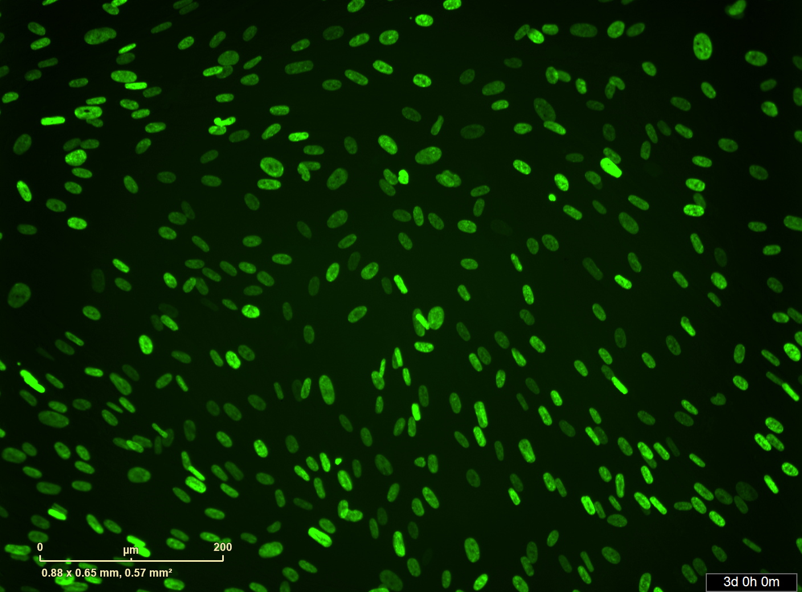

# Micronuclei detection




## Installation
This tool need to be installed before use. All the requirements are in `requirements.txt`. Please install pytorch and torchvision dependencies. 

You can install this tool on a GPU machine using:

```
git clone https://github.com/kew6688/MicroNuclei_Detection.git && cd MicroNuclei_Detection
pip install -e .
```
 

## Usage:
Automated pipeline to process images. Further details will be add [here](www...)
 
 This includes 
 - predict counts of micronuclei
 - predict masks
 - output a info dictionary with box, center location and size

Please refer to the examples in the [tutorial.ipynb](./tutorial.ipynb)

